# 数字图像处理作业报告
## 报告信息
### 名称：数字图像处理第三次作业
### 姓名：翟宏佳
### 班级：电信钱61
### 学号：2160405066

## 第一题：空域低通滤波器：分别用高斯滤波器和中值滤波器去平滑测试图像test1和2，模板大小分别是3x3 ， 5x5 ，7x7； 分析各自优缺点；-利用固定方差 sigma=1.5产生高斯滤波器. 附件有产生高斯滤波器的方法； 分析各自优缺点；

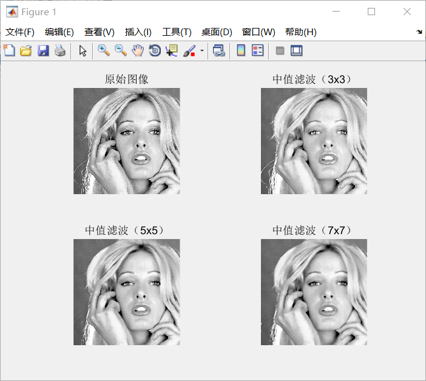

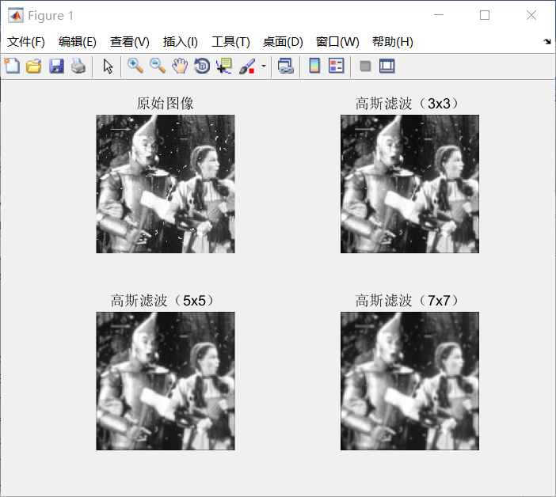

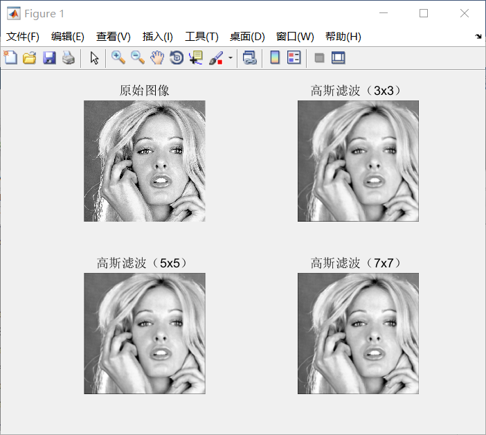

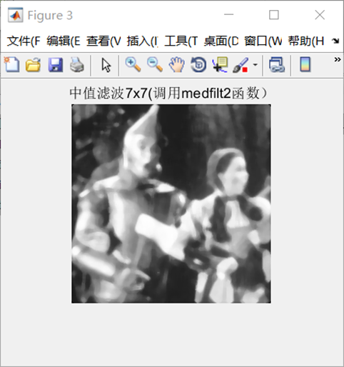

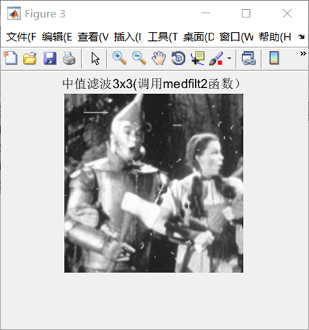

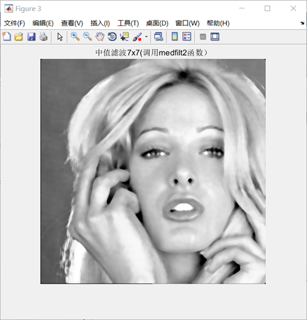

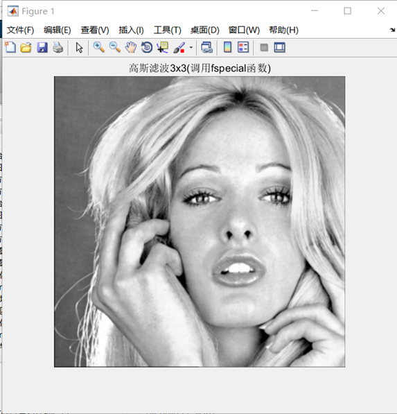

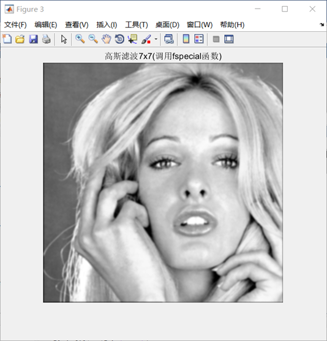

## 第二题：利用高通滤波器滤波测试图像test3, 4：包括unsharp masking, Sobel edge detector, and Laplace edge detection；Canny algorithm.分析各自优缺点；

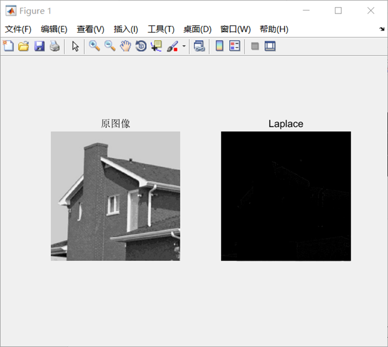

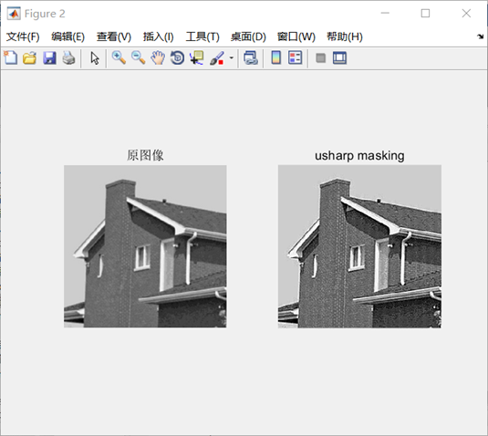

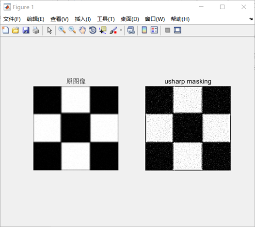

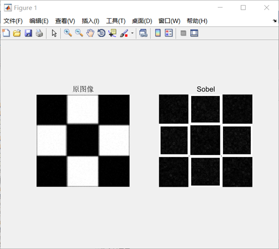

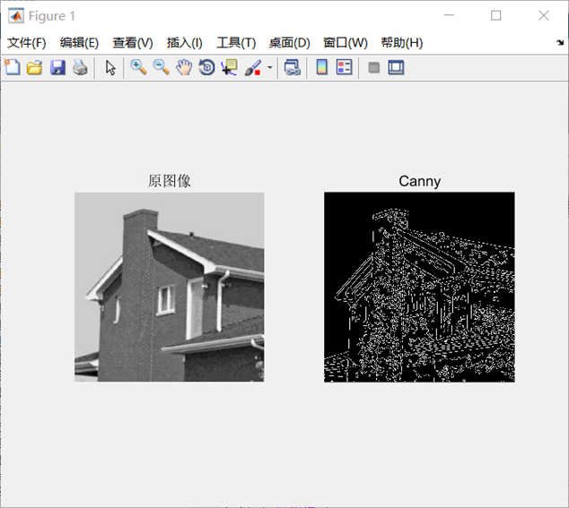

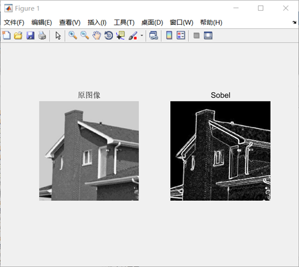

